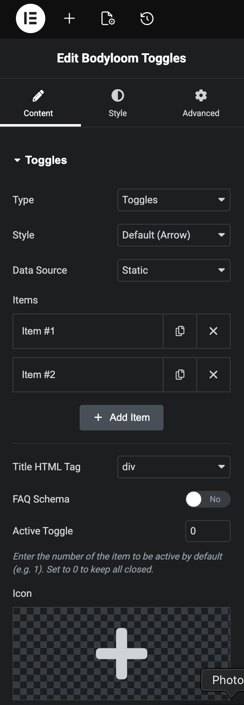
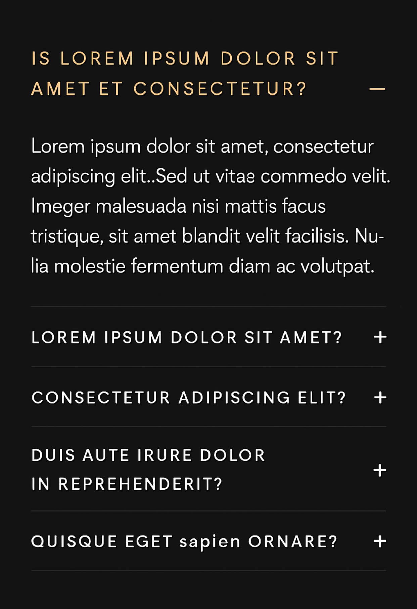

# Bodyloom Dynamic Toggles

**Contributors:** Jimmy Thanki  
**Tags:** toggles, accordion, acf, metabox, pods  
**Requires at least:** 5.0  
**Tested up to:** 6.7  
**Requires PHP:** 7.4  
**License:** GPLv2 or later  

## Description

Bodyloom Dynamic Toggles allows you to easily create dynamic toggles and accordions using data from your favorite custom field plugins.

**Key Features:**
*   **Universal Support:** Works with Elementor, Gutenberg, Divi, and more.
*   **Multi-Provider:** Supports ACF Pro, Meta Box, and Pods.
*   **SEO Friendly:** Optional FAQ Schema generation.
*   **Accessible:** WAI-ARIA compliant.
*   **Customizable:** Multiple built-in styles (Arrow, Plus/Minus, Chevron).

## Installation

1. Upload `bodyloom-dynamic-toggles` to the `/wp-content/plugins/` directory.
2. Activate the plugin through the 'Plugins' menu in WordPress.

## Usage

**Shortcode:**
`[bodyloom_toggles repeater="my_repeater" title_field="question" content_field="answer"]`

**Elementor:**
Search for the "Bodyloom Toggles" widget and drag it into your layout.

**Gutenberg:**
Search for the "Dynamic Toggles" block and add it to your post or page.

## Changelog

### 1.0.0
*   Initial release.

## Screenshots

*Elementor Elements Panel*

*Content Panel*

*Style Panel*

*Advanced Panel*

*Rendered Frontend Example*

